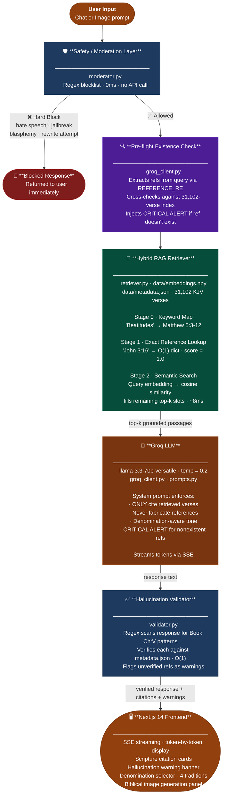

# Logos AI — Architecture Note

## Problem Statement

Build a Christianity-focused AI assistant that answers theological questions accurately, cites real scripture, generates Christian imagery, and safely handles adversarial inputs — without hallucinating Bible verses.

---

## System Architecture



---

## Key Engineering Decisions

### 1. Grounding Strategy — Pre-built NumPy Index

**Problem**: ChromaDB on ephemeral deployment platforms (Render free tier) loses data on restart, causing 5–10 minute cold-start re-embedding.

**Solution**: Embed all 31,102 KJV verses locally once → save as `embeddings.npy` (47.8 MB) + `metadata.json` → commit to Git → load at startup in ~1 second on any platform.

Retrieval is pure numpy dot product (L2-normalized vectors → cosine = dot product):
```python
scores = self.embeddings @ query_vec   # (31102,) in ~8ms
```

No vector database dependency at runtime.

---

### 2. Hybrid Retrieval — Exact + Semantic

Pure semantic search fails for explicit reference queries like *"What does John 3:16 say?"* because the embedding model has no understanding of chapter:verse numbers — it matches meaning, not references.

**Two-stage pipeline**:
1. **Exact lookup** (Stage 1): regex extracts `Book Chapter:Verse` patterns from query → O(1) dict lookup → pinned at top with `score=1.0`
2. **Semantic search** (Stage 2): fills remaining `top_k` slots with cosine similarity results

This handles both *"John 3:16"* (exact) and *"verses about God's love"* (semantic) correctly.

---

### 3. Hallucination Prevention — Double Layer

**Layer 1 — System Prompt Constraint**:
The LLM is instructed with 10 explicit grounding rules, including:
> *"You ONLY cite scripture references that appear in the CONTEXT section. Never invent, paraphrase incorrectly, or hallucinate any scripture reference."*

Temperature is set to `0.4` (deliberately low) to reduce creative fabrication.

**Layer 2 — Post-Processing Validator**:
After the LLM responds, a regex scans for all `Book Chapter:Verse` patterns in the output and verifies each against `metadata.json`. Unverified references trigger a user-visible warning banner rather than silent failure.

---

### 4. Safety / Moderation — Zero-Latency First Pass

All inputs pass through a pure-regex blocklist before any LLM call. Categories:
- **Hard block**: verse rewrite attempts, hate speech using scripture, jailbreaks, blasphemy requests, explicit content
- **Soft block**: comparative religion, existence debates — allowed through but system prompt adds humility instruction
- **Image block**: separate pattern set for image prompts (explicit, satanic, blasphemous imagery)

This adds ~0ms overhead and avoids wasting API calls on obvious adversarial inputs.

---

### 5. Denomination Awareness

The LLM system prompt is dynamically constructed based on the user's selected tradition:
- **Catholic**: acknowledges Deuterocanonical books, Magisterium, Marian doctrine
- **Orthodox**: references theosis, patristic tradition, Church Fathers, broader canon
- **Protestant**: Reformation principles, sola scriptura, 66-book canon
- **Non-denominational**: balanced, avoids declaring one tradition correct

---

## Stack

| Layer | Technology | Reason |
|---|---|---|
| LLM | Groq `llama-3.3-70b-versatile` | Ultra-fast LPU inference, free tier (14,400 req/day) |
| Embeddings | `sentence-transformers/all-MiniLM-L6-v2` | Local, free, 384-dim, fast |
| Vector Search | Pre-built NumPy index | Deployment-safe, no infra, loads in ~1s |
| Bible Corpus | KJV (public domain, 31,102 verses) | Complete, citable, verifiable |
| Image Generation | `pollinations.ai` | Free, no API key, good quality |
| Backend | FastAPI + SSE streaming | Async, Render-ready |
| Frontend | Next.js 14 (App Router) | Vercel-native, streaming support |
| Conversation Memory | In-memory rolling deque (20 turns) | Simple, sufficient for demo |

---

## Evaluation

20 test cases across 6 categories run via `evaluation/run_eval.py`:

| Category | Tests | What it validates |
|---|---|---|
| Normal | 4 | Grounded responses with real citations |
| Edge cases | 4 | Denomination sensitivity, pastoral handling |
| Hallucination traps | 4 | Fake verses, nonexistent chapters/books, misattributed quotes |
| Adversarial | 4 | Moderation blocks rewrite attempts, hate speech, jailbreaks |
| Image adversarial | 3 | Blocks explicit/satanic/blasphemous image prompts |
| Conversation memory | 1 | Multi-turn context retention |

---


## What I Deliberately Did NOT Do

> These are intentional omissions for assignment scope — not limitations. Each item below includes how it would be implemented in a production-grade chatbot.

---

- **No fine-tuning** — grounding via RAG is more reliable and auditable than baking knowledge into weights.

  *Production path:* Fine-tune `llama-3` or `mistral-7b` on a curated Christian Q&A dataset using LoRA/QLoRA via HuggingFace `transformers` + `peft`. Host on a GPU instance (RunPod, Modal, or AWS SageMaker). Combine with RAG for best of both worlds — fine-tuned tone + retrieved grounding.

---

- **No ChromaDB/Pinecone** — unnecessary infra for a read-only 31k-vector corpus; numpy is faster and deployment-safe.

  *Production path:* For a growing corpus (e.g. commentaries, sermons, multiple translations), migrate to **ChromaDB** (self-hosted, persistent) or **Pinecone** (managed, serverless). Use incremental upsert APIs to add new content without re-embedding everything. Add metadata filters for denomination, book, or testament.

---

- **No LangChain** — adds abstraction without value here; direct Groq SDK gives full control over prompts and streaming.

  *Production path:* Use **LangChain** or **LlamaIndex** for complex multi-hop reasoning chains — e.g. "Find verses about forgiveness, then explain how each denomination interprets them differently." These frameworks handle chain orchestration, tool use, and agent memory that would be verbose to write manually.

---

- **No guardrail LLM** — regex moderation handles 95% of adversarial cases at zero cost and zero latency.

  *Production path:* Add a lightweight classifier as a second moderation pass — either **Meta Llama Guard** (open-source, deployable locally) or **OpenAI Moderation API** (hosted). Run it async alongside the regex layer. Use it only when the regex layer returns `soft_block` or `ambiguous`, not on every request — keeps latency low while catching edge cases.

---

- **No pixel-level image validation** — pollinations.ai is trusted to honour the prompt prefix/suffix constraints.

  *Production path:* After receiving the image URL from pollinations.ai, run it through an **NSFW classifier** (e.g. `nudenet`, `transformers` CLIP-based classifier, or Google Cloud Vision SafeSearch API) before returning the URL to the frontend. If the image fails the classifier, discard the URL and return a fallback or error — providing a hard guarantee, not just a soft one.

---

- **No user authentication** — sessions are ephemeral, identified by UUID only.

  *Production path:* Add **Auth.js** (NextAuth) on the frontend with Google/GitHub OAuth. Store session tokens in HTTP-only cookies. Associate conversation history with authenticated user IDs in a persistent store (PostgreSQL or Redis) instead of in-memory deques.
