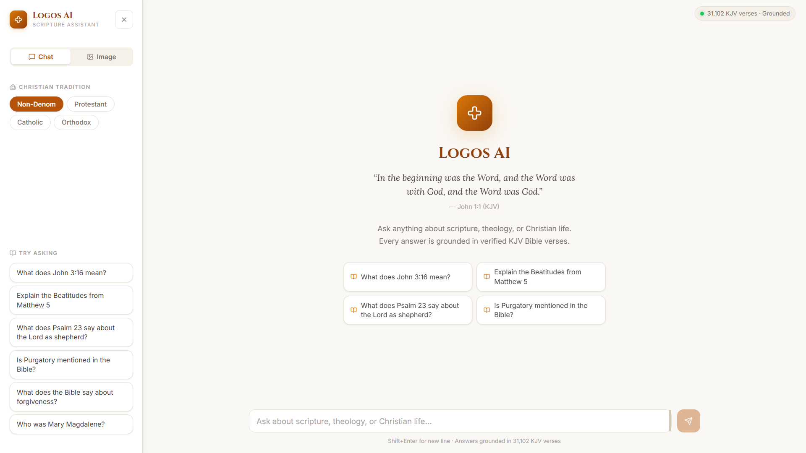

# Logos AI — Christian Scripture Assistant

> A grounded, scripture-aware AI assistant. Every answer verified against 31,102 KJV verses.

---

## User Interface



---


## What It Does

- **Answers Christian questions** grounded in verified KJV scripture (never fabricates verses)
- **Generates Christian imagery** with 4-layer safety enforcement:
  - Layer 1 — Blocks harmful prompts (explicit, satanic, blasphemous) via regex
  - Layer 2 — Blocks off-topic prompts via keyword whitelist + cosine similarity (all-MiniLM-L6-v2)
  - Layer 3 — Wraps every allowed prompt in a Christian aesthetic prefix/suffix
  - Layer 4 — `seed=42` ensures same prompt always returns same deterministic image
- **Handles denomination differences** — Catholic, Protestant, Orthodox, Non-denominational
- **Blocks adversarial text inputs** — verse rewrites, hate speech, jailbreaks, blasphemy
- **Warns on hallucinations** — post-processes LLM output to flag unverified references
- **Maintains conversation memory** — multi-turn session context (20-turn rolling window)

---

## Tech Stack

| Layer | Technology |
|---|---|
| LLM | Groq `llama-3.3-70b-versatile` (free) |
| Embeddings | `sentence-transformers/all-MiniLM-L6-v2` (local) |
| Vector Search | Pre-built NumPy index (31,102 KJV verses, 47.8 MB) |
| Image Generation | `pollinations.ai` (free, no key) |
| Backend | FastAPI + SSE streaming → Render |
| Frontend | Next.js 14 (App Router) → Vercel |

---

## Project Structure

```
SoluLab/
├── render.yaml              ← Render Blueprint (repo root)
├── ARCHITECTURE.md          ← Engineering decisions
│
├── backend/
│   ├── main.py              ← FastAPI app (routes: /chat, /image, /health)
│   ├── config.py            ← All constants & env vars
│   ├── requirements.txt
│   ├── .env.example
│   │
│   ├── rag/
│   │   ├── build_index.py   ← Run ONCE locally to build embeddings
│   │   └── retriever.py     ← Hybrid exact + semantic retrieval
│   │
│   ├── llm/
│   │   ├── groq_client.py   ← Groq streaming wrapper
│   │   └── prompts.py       ← System prompt + denomination logic
│   │
│   ├── safety/
│   │   ├── moderator.py     ← Regex safety layer (0ms overhead)
│   │   └── validator.py     ← Post-LLM hallucination detector
│   │
│   ├── memory/
│   │   └── session_store.py ← In-memory conversation history
│   │
│   ├── image/
│   │   └── generator.py     ← pollinations.ai image generation
│   │
│   └── data/                ← Pre-built KJV index (not in .gitignore)
│       ├── embeddings.npy   ← 31,102 × 384 float32 (47.8 MB)
│       └── metadata.json    ← Verse metadata
│
├── frontend/                ← Next.js 14 App
│   ├── app/
│   │   ├── page.tsx         ← Main chat UI
│   │   ├── layout.tsx
│   │   ├── globals.css      ← Light parchment theme
│   │   └── components/
│   │       ├── ChatBubble.tsx
│   │       ├── DenominationSelector.tsx
│   │       └── ImagePanel.tsx
│   ├── vercel.json
│   └── .env.local
│
└── evaluation/
    ├── eval_dataset.json    ← 20 test cases (6 categories)
    └── run_eval.py          ← Automated eval runner
```

---

## Local Development

### Prerequisites
- Python 3.11+
- Node.js 18+
- Groq API key (free at [console.groq.com](https://console.groq.com))

### 1. Build the Bible index (ONE TIME ONLY)
```bash
cd backend
pip install -r requirements.txt
python rag/build_index.py
# Takes ~3 min — downloads 66 book JSONs, embeds 31,102 verses
# Saves: backend/data/embeddings.npy + backend/data/metadata.json
```

### 2. Set up environment
```bash
# backend/.env
GROQ_API_KEY=your_key_here
FRONTEND_URL=http://localhost:3000
```

### 3. Start backend
```powershell
cd backend
$env:PYTHONUTF8="1"
python -m uvicorn main:app --host 0.0.0.0 --port 8000 --reload
```
> API: http://localhost:8000  
> Docs: http://localhost:8000/docs  
> Health: http://localhost:8000/health  

### 4. Start frontend
```bash
cd frontend
npm install
npm run dev
```
> App: http://localhost:3000

### 5. Run evaluation suite
```bash
# Run from repo root (not from backend/)
$env:PYTHONUTF8="1"   # Windows only
python evaluation/run_eval.py
```
> Expected: **20/20 (100%)** — all categories PASS

---

## Deployment

### Backend → Render

1. Push repo to GitHub
2. Go to [dashboard.render.com](https://dashboard.render.com) → **New+** → **Blueprint**
3. Connect your repository — Render reads `render.yaml` from root automatically
4. Set environment variables in Render dashboard:
   - `GROQ_API_KEY` → your Groq key
   - `FRONTEND_URL` → your Vercel URL (set after frontend deploy)
5. Deploy

> **Note:** `backend/data/embeddings.npy` must be committed to Git.  
> If it exceeds GitHub's 100MB limit, use [Git LFS](https://git-lfs.com):
> ```bash
> git lfs install
> git lfs track "*.npy"
> git add .gitattributes
> ```

### Frontend → Vercel

```bash
cd frontend
npx vercel --prod
```

Or connect via Vercel dashboard → set `NEXT_PUBLIC_API_URL` to your Render backend URL.

---

## Evaluation Results

Run `python evaluation/run_eval.py` from the repo root. Expected results:

| Category | Tests | Expected |
|---|---|---|
| Normal questions | 4 | PASS — grounded citations |
| Edge cases | 4 | PASS — graceful handling |
| Hallucination traps | 4 | PASS — refuses to fabricate |
| Adversarial (text) | 4 | PASS — moderation blocks |
| Adversarial (image) | 3 | PASS — image moderation blocks |
| Conversation memory | 1 | PASS — context retained |
| **Total** | **20** | **20/20 (100%)** |

---

## Architecture

See [ARCHITECTURE.md](./ARCHITECTURE.md) for full engineering decisions.

---

## Security Notes

- Never commit `.env` — add it to `.gitignore`
- Rotate the Groq API key periodically
- The `embeddings.npy` file is read-only at runtime — safe to commit
- Image generation uses 4 safety layers — but AI-generated images carry no absolute guarantee; treat as moderated, not certified
- The cosine similarity biblical relevance check (`threshold=0.22`) uses the same `all-MiniLM-L6-v2` model as RAG — zero extra memory or latency cost

---

## License

MIT License - See LICENSE file for details
